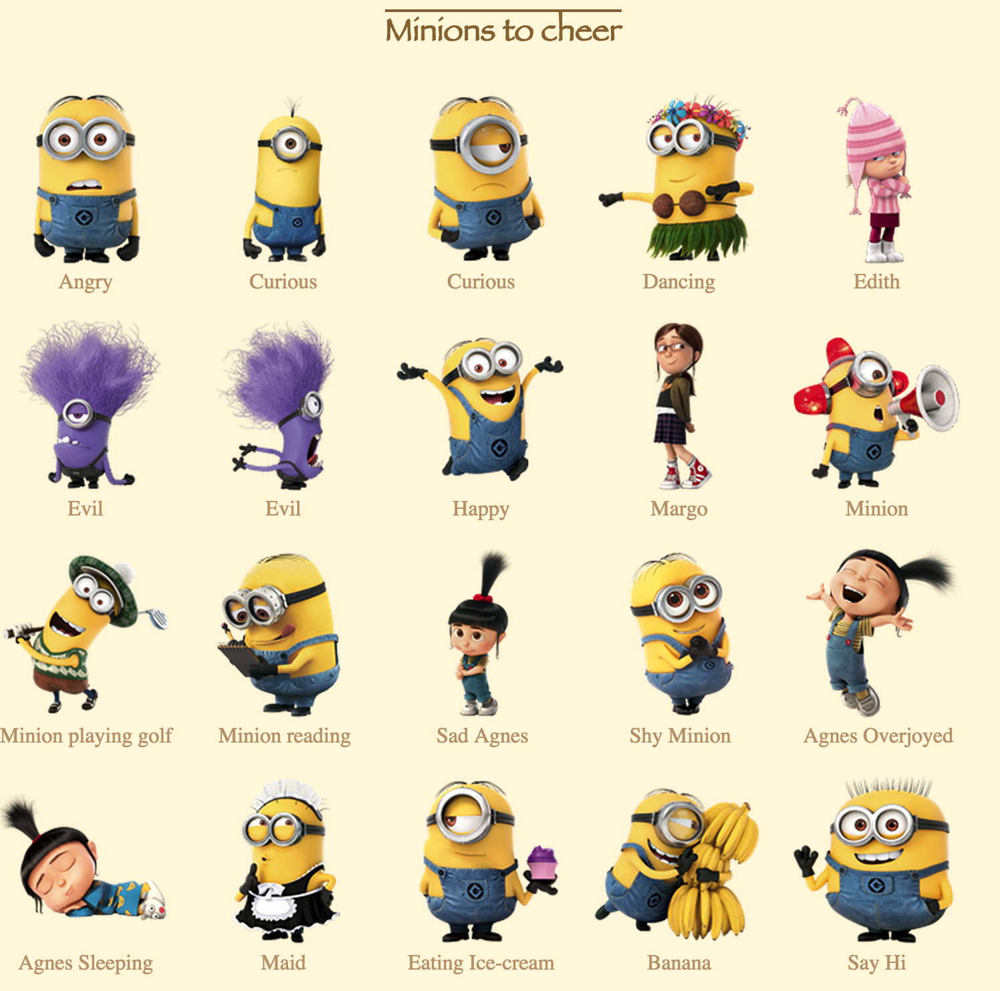

Hubot-minions
-----------

Show despicable minions photos to cheer up your team.

See list of all minions [here](http://sahilsk.github.io/hubot-minions/)

Installation
------------

First run `npm install hubot-minions`, then add `hubot-minions` to the `external-scripts.json` file.

Usage
-----

- Get random minion

		botname minion

- Get minion by tags
	
	Each picture is given a list of tags. It pick one picture randomly matching the specified tag;
	Find all tags [here: https://github.com/sahilsk/hubot-minions/blob/master/lib/minions.js#L5-L36](https://github.com/sahilsk/hubot-minions/blob/master/lib/minions.js#L5-L36)

		botname minion swim

	

Cute Minions
-------

Find them [here](http://sahilsk.github.io/hubot-minions/)

LICENSE
-------

MIT
